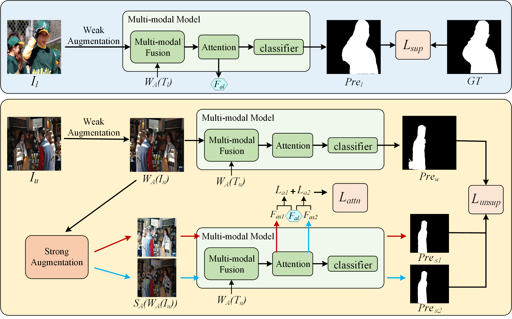

# DAM-Net
**Attention-Guided Dual-Stream Network: Enhancing Semi-Supervised Referring Segmentation Performance**

This repository contains the implementation and resources for the paper titled "Attention-Guided Dual-Stream Network: Enhancing Semi-Supervised Referring Segmentation Performance" by Huanhuan Zhou, Jianqi Zhang, Ling Bai, Tingmin Liu, and Ying Zang.

## Overview

DAM-Net is a novel deep learning framework designed for semi-supervised referring segmentation tasks. It utilizes a dual-stream architecture and attention-guided mechanisms to effectively segment objects referred to in natural language descriptions.

<p align="left">

</p>

## Getting Started

### Installation

```
conda create -n DAM-Net python=3.8.4
conda activate DAM-Net
pip install -r requirements.txt
```

### Dataset

COCO: [train2017](http://images.cocodataset.org/zips/train2017.zip) | [val2017](http://images.cocodataset.org/zips/val2017.zip) | [masks](https://drive.google.com/file/d/166xLerzEEIbU7Mt1UGut-3-VN41FMUb1/view?usp=sharing)

pretrained weights and dataset partitioning, etc：

[Link](https://pan.baidu.com/s/10uwKKG5Ie8Dq2IvDI9HJcw)
Extraction code: snpi

Please modify your dataset path in configuration files.

```
├── [Your anns Path]
    ├── refcoco
    	└──*.json
    ├── refcoco+
    	└──*.json
    └── refcocog
    	└──*.json
    
├── [Your weights Path]
    ├── bert-base-uncased
    └── pretrained_weights
    	└── *.pth
    
├── [Your COCO Path]
    ├── train2017
    ├── val2017
    └── masks
```


### Usage

```
#train
python train.py --backbone swin_tiny --save_path  /exp  --nodes 1 --port 12345 --gpus 4  --epochs 40 --batch_size 4  --w_CE 5.0 --w_con 2.0 --num_workers 8  --dataset refcoco --splitBy unc  --labeled_data path/refcoco_10%_image.json --unlabeled_data path/refcoco_90%_image.json

```

